# ⚽ GOALTRIP - Landing Page Mundial 2026 (Generación por IA)

Este repositorio contiene el resultado de un proyecto de maquetación de una Landing Page para una agencia de turismo deportivo ("GOALTRIP") orientada al Mundial 2026, generada a través de Inteligencia Artificial utilizando diferentes agentes.

## 👨‍💻 Datos del Estudiante
* **Nombre y Apellido:** Lorena Cohene Báez
* **Año, cuatrimestre y comisión:** 2° año, primer cuatrimestre, comisión C (2026)
* **Carrera:** Tecnicatura en Desarrollo de Software
* **Materia:** Front-End
* **Institución:** IFTS N° 29

## 🚀 Link al Deploy Unificado
Puedes visualizar el resultado final de los proyectos desplegados en el siguiente enlace:
🔗 **[https://pfo-2-frontend.vercel.app/](https://pfo-2-frontend.vercel.app/)**

## 🤖 Agentes IA utilizados

- Codex 
    - Modelo: 5.5 medio
- Claude
    - Modelo: Sonet 4.6 Bajo
---

## 🤖 Prompt Exacto Utilizado

A continuación se detalla el prompt exacto que se ingresó a las inteligencias artificiales para generar el código:

> Actúa como un Desarrollador Frontend Senior experto en diseño UI/UX y optimización de conversiones (CRO).
> 
> Tu tarea es generar el código completo (HTML y CSS, obligatoriamente usando Tailwind CSS a través de CDN para estandarizar los estilos) para un proyecto web de una página.
> 
> <contexto>
> El proyecto es para una agencia de turismo deportivo llamada GOALTRIP. El objetivo comercial de la Landing Page es captar leads y promocionar un servicio premium de venta de pasajes y estadías exclusivas para el Mundial de Fútbol 2026 (Estados Unidos, México y Canadá). El diseño debe transmitir la energía del evento, generar confianza y utilizar colores temáticos para afianzar la identidad visual.
> </contexto>
> 
> <guia_de_estilo>
> Para lograr el impacto visual deseado, TE SUGIERO utilizar una paleta de colores inspirada en el branding oficial del Mundial de la FIFA 2026.
> - Colores: Piensa en tonos vibrantes, enérgicos e inclusivos (como púrpuras, verdes neón, magentas, rojos o azules eléctricos) combinados con fondos oscuros (negros o grises profundos) para generar alto contraste, o fondos claros y limpios para las zonas de lectura.
> - Tipografía: Usa fuentes de Google Fonts sin serifa y modernas (ej. 'Inter' o 'Montserrat' para títulos en negrita, y 'Roboto' para cuerpo de texto).
> </guia_de_estilo>
> 
> <requisitos_proyecto>
> El proyecto consta de una parte que debes maquetar:
> 
> 1. LANDING PAGE DEL MUNDIAL 2026 - GOALTRIP (landing.html):
> Una página de aterrizaje de alta conversión completamente responsive que incluya estrictamente las siguientes secciones en este orden, aplicando la <guia_de_estilo>:
> - Cabecera (Header): Con texto que contraste bien con el fondo. Debe mostrar el nombre de la marca "GOALTRIP" como logotipo textual a la izquierda (usando fuente en negrita y algún color de acento) y un menú de navegación a la derecha.
> - Hero Section: Fondo oscuro o imagen de estadio (usando un overlay). Título de alto impacto ("Vive el Mundial 2026 con GOALTRIP..."), subtítulo persuasivo y un botón de CTA destacado usando un color vibrante de tu elección que invite al clic.
> - Descripción / Sobre Nosotros: Breve sección clara (idealmente fondo claro) que explique la propuesta de valor de GOALTRIP.
> - Sección de Servicios: Una grilla o tarjetas mostrando las características principales (Vuelos, Hospedaje, Traslados).
> - Testimonios: Reseñas ficticias de clientes de mundiales anteriores agradeciendo a la agencia.
> - Formulario de contacto: Fondo que contraste con las secciones anteriores. Maquetado visual con campos para Nombre, Email, Teléfono, Paquete de interés y un botón de envío en un color de acento llamativo. (Solo maquetación visual, sin lógica backend).
> - Pie de página (Footer): Diseño sobrio, repetición de la marca GOALTRIP, derechos reservados y enlaces a redes sociales.
> </requisitos_proyecto>
> 
> <instrucciones_de_salida>
> 1. Genera el código completo de la "Landing Page".
> 2. Asegúrate de que ambas páginas sean 100% adaptables a dispositivos móviles.
> 3. Aplica las clases de Tailwind que mejor representen los colores sugeridos para el Mundial 2026 (usando colores por defecto de Tailwind o extendiendo la configuración con valores arbitrarios si lo ves necesario).
> 4. Usa placeholders visuales si necesitas ilustrar fondos de estadios o iconos. No agregues explicaciones fuera del código, solo entrega el código listo para probar.
> </instrucciones_de_salida>

---

## 📸 Capturas de Pantalla y Demostraciones

A continuación se muestran las interfaces generadas, separadas según el agente de IA utilizado y adaptadas a diferentes dispositivos (Desktop, Tablet, Mobile). Se incluye una vista estática (PNG) y una animación de la navegación (GIF).

### 🖼️ Portadas del Sitio
Vista general de la interfaz unificada:

#### 💻 Vista Escritorio 
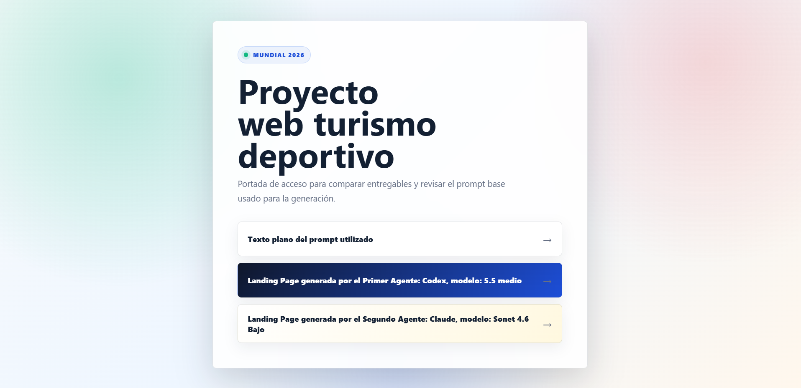 
#### 📱 Vista Tablet 
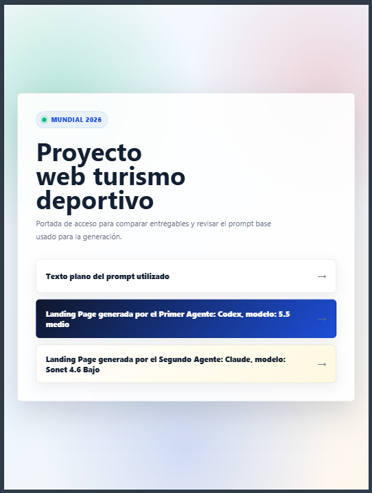 
#### 📱 Vista Móvil
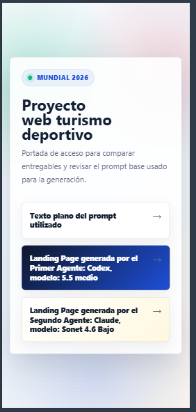

---

### 🤖 Agente 1: Codex

#### 💻 Vista Escritorio
* **Imagen Estática:**
  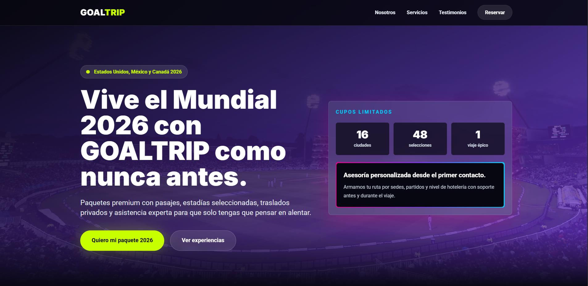
* **Navegación Animada:**
  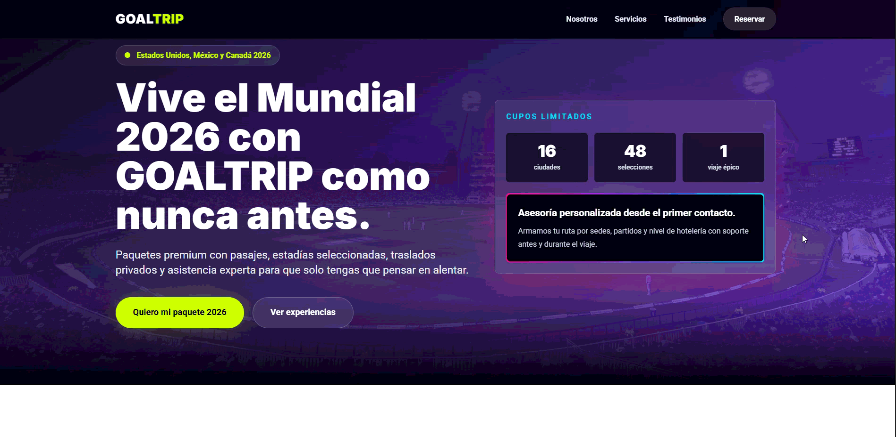

#### 📱 Vista Tablet
* **Imagen Estática:**
  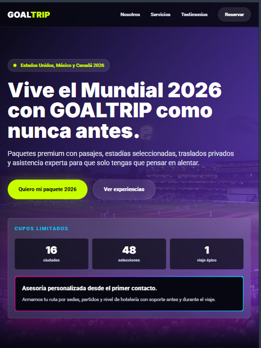
* **Navegación Animada:**
  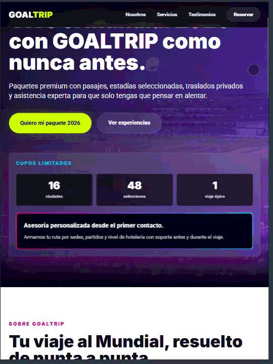

#### 📱 Vista Móvil
* **Imagen Estática:**
  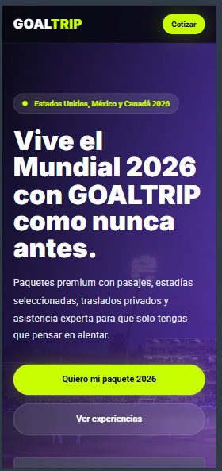
* **Navegación Animada:**
  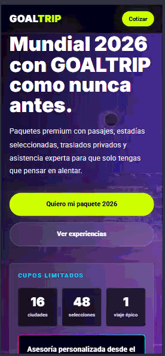

---

### 🤖 Agente 2: Claude

#### 💻 Vista Escritorio
* **Imagen Estática:**
  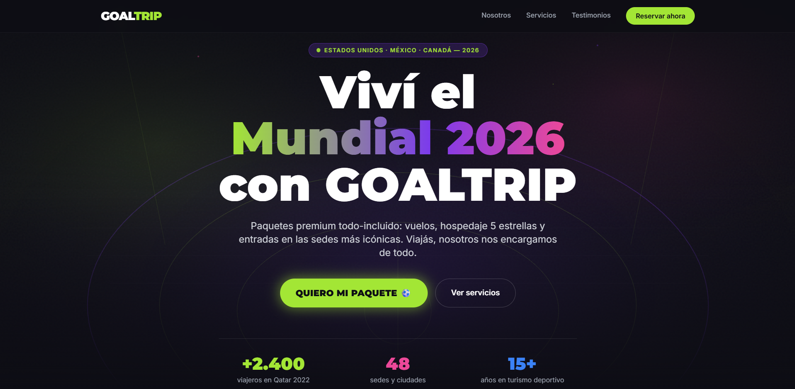
* **Navegación Animada:**
  

#### 📱 Vista Tablet
* **Imagen Estática:**
  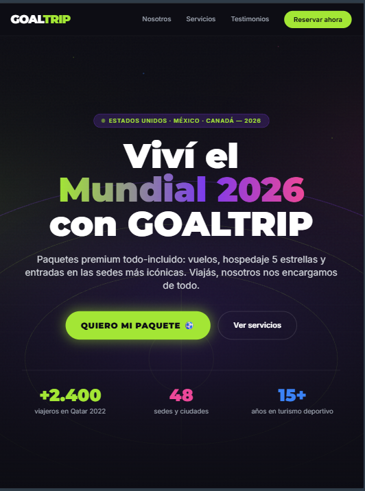
* **Navegación Animada:**
  

#### 📱 Vista Móvil
* **Imagen Estática:**
  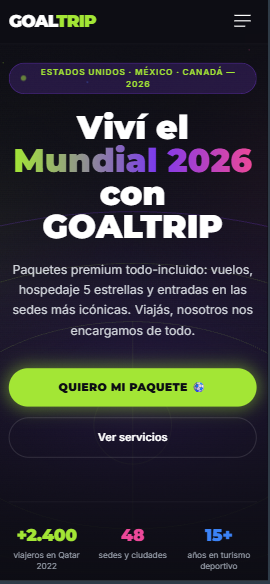
* **Navegación Animada:**
  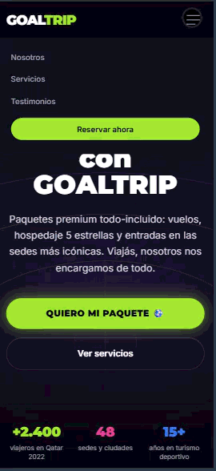

---

## 📁 Estructura de Carpetas del Proyecto

```text
📦 Raíz del proyecto
├── 📂 agente1_codex/
├── 📂 agente2_claude/
├── 📂 img/
│   ├── 📂 agente1_codex/  
│   ├── 📂 agente2_claude/
│   ├── 🖼️ portada_full.png
│   ├── 🖼️ portada_mobile.png
│   └── 🖼️ portada_tablet.png
├── 📄 .gitignore
├── 📄 index.html
├── 📄 prompt.txt
└── 📄 README.md